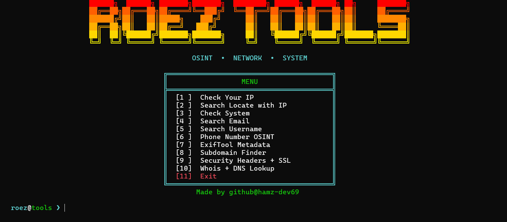

<div align="center">

# ROEZ TOOLS

**A menu-driven terminal toolkit for OSINT, network recon, and system checks.**

Python 3 · Linux (Ubuntu / Kali) · Single file · No config

<br>

<!-- Put your screenshot at assets/screenshot.png -->


</div>

<br>

## Overview

ROEZ TOOLS bundles ten commonly used recon utilities behind a single interactive menu. It does not reimplement the heavy lifting: it wraps established tools (Holehe, Sherlock, Subfinder, ExifTool, whois, dig) and parses their output into a clean, readable format, so you don't have to remember flags or switch between terminals.

The whole project is one Python file with a small dependency list.

## Features

| # | Tool | What it does | Powered by |
|---|------|--------------|------------|
| 1 | Check Your IP | Shows hostname, local IP, and public IP | `socket`, ipify |
| 2 | Search Locate with IP | Country, region, city, ISP, ASN, and proxy/hosting flags for any IP | ip-api.com |
| 3 | Check System | System summary through `neofetch` or `fastfetch`, with a built-in fallback | neofetch / fastfetch |
| 4 | Search Email | Lists services where an email address is registered | [Holehe](https://github.com/megadose/holehe) |
| 5 | Search Username | Finds accounts using a username across social platforms | [Sherlock](https://github.com/sherlock-project/sherlock) |
| 6 | Phone Number OSINT | Validity, region, carrier, line type, and time zone | [phonenumbers](https://github.com/daviddrysdale/python-phonenumbers) |
| 7 | ExifTool Metadata | Reads file metadata and flags embedded GPS data | [ExifTool](https://exiftool.org) |
| 8 | Subdomain Finder | Passive subdomain enumeration for a domain | [Subfinder](https://github.com/projectdiscovery/subfinder) |
| 9 | Security Headers + SSL | Checks six security headers (with a score) and the TLS certificate, including days until expiry | `curl`, Python `ssl` |
| 10 | Whois + DNS Lookup | Registrar, creation and expiry dates, nameservers, plus A, AAAA, MX, NS, and TXT records | whois, dig |

## Requirements

- Linux (developed and used on Ubuntu and Kali)
- Python 3.8 or newer
- A terminal with 256-color and Unicode support
- Terminal width of at least 85 columns for the logo to render correctly

## Installation

**1. Clone the repository**

```bash
git clone https://github.com/hamz-dev69/roez-tools.git
cd roez-tools
```

**2. Install system packages**

```bash
sudo apt update
sudo apt install curl whois dnsutils libimage-exiftool-perl neofetch
```

**3. Install Python packages**

```bash
pip3 install -r requirements.txt
```
Or 
```bash
pip3 install -r requirements.txt --break-system-packages
```

**4. Install Subfinder**

On Kali:

```bash
sudo apt install subfinder
```

On other distributions, install it with Go:

```bash
go install -v github.com/projectdiscovery/subfinder/v2/cmd/subfinder@latest
```

Make sure `$HOME/go/bin` is in your `PATH`.

> Missing tools do not crash the program. If a dependency is not found, the related feature prints the exact install command instead.

## Usage

```bash
python3 roez-tools.py
```

Or make it executable and run it directly:

```bash
chmod +x roeztools.py
./roez-tools.py
```

Select a feature by typing its number at the `roez@tools ❯` prompt and pressing Enter. After each tool finishes, press Enter to return to the menu.

### Run it from anywhere (optional)

```bash
sudo cp roeztools.py /usr/local/bin/roez
sudo chmod +x /usr/local/bin/roez
```

Then start it with `roez` from any directory.

## Project structure

```
roez-tools/
├── assets/
│   └── screenshot.png
├── roeztools.py
├── requirements.txt
└── README.md
```

## Platform support

ROEZ TOOLS targets Linux. It calls `clear` and `which`, which do not exist on native Windows, so it will not work correctly in Command Prompt or PowerShell. On Windows, run it inside [WSL](https://learn.microsoft.com/windows/wsl/).

## Notes on external services

- **Features 1 and 2** send requests to third-party services (`api.ipify.org` and `ip-api.com`). The free tier of ip-api.com is rate limited (about 45 requests per minute) and intended for non-commercial use.
- **Features 4 and 5** make requests to many websites in a single run. Scan times vary with your connection and can take a while for Sherlock.
- **Results are not guaranteed to be complete or accurate.** Sites change their behavior, and username or email matches can be false positives. Verify findings before relying on them.

## Legal disclaimer

This project is intended for education, security research, and investigations you are authorized to perform. Run it only against targets you own or have explicit permission to test, and follow the laws that apply where you live. The author is not responsible for misuse or for any damage caused by this software.

## Credits

ROEZ TOOLS is a front end for the work of others. Full credit to the authors and maintainers of [Holehe](https://github.com/megadose/holehe), [Sherlock](https://github.com/sherlock-project/sherlock), [Subfinder](https://github.com/projectdiscovery/subfinder), [ExifTool](https://exiftool.org), [python-phonenumbers](https://github.com/daviddrysdale/python-phonenumbers), and the [ip-api](https://ip-api.com) and [ipify](https://www.ipify.org) services.

## Author

Made by [hamz-dev69](https://github.com/hamz-dev69)
